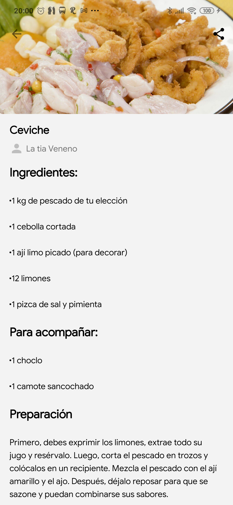

<h1 align='center'>Peruvian Food App</h1>

  

  
  
  

## Description

An app to show the world the Peruvian food 🇵🇪 and enjoy preparing it.

**_You can try the latest Peruvian Food app from below 👇_**

## Licence

MIT
